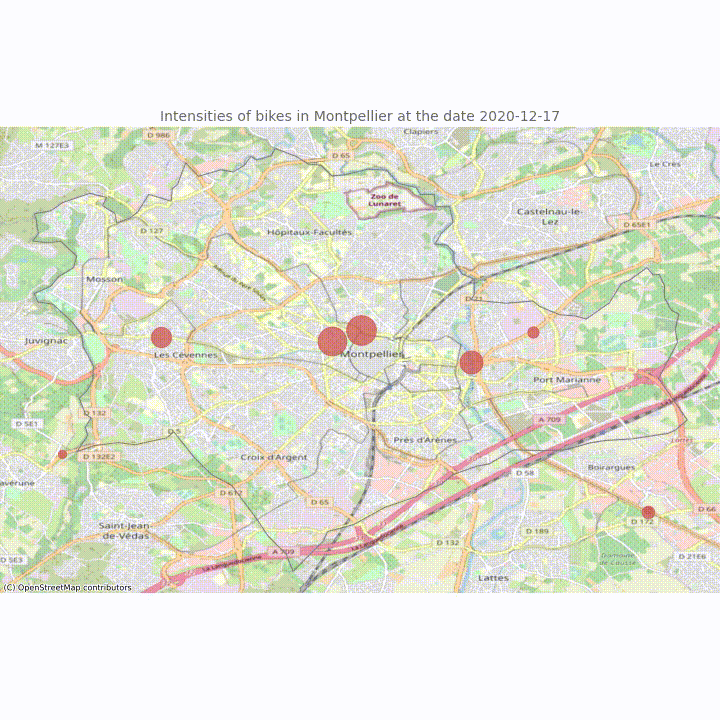

# Bike traffic challenge

> **Author**: Chloé Serre-Combe - chloe.serre-combe@etu.umontpellier.fr

This is a small challenge from course Software Development (HMMA238) from first year master’s degree in statistics in Montpellier, France.

There are two parts in this challenge : a prediction part and a visualization part.

# Prediction part

In this part, the aim is to predict the number of bikes passing between 00:01 AM and 09:00 AM on Friday, April 2nd at "Albert 1er" counter.

Data used are from https://docs.google.com/spreadsheets/d/e/2PACX-1vQVtdpXMHB4g9h75a0jw8CsrqSuQmP5eMIB2adpKR5hkRggwMwzFy5kB-AIThodhVHNLxlZYm8fuoWj/pub?gid=2105854808&single=true&output=csv.

# Visualization part

In this part, the aim is to create a visualization using data from http://data.montpellier3m.fr/dataset/comptages-velo-et-pieton-issus-des-eco-compteurs/ to visualize the bike traffic in Montpellier. 

The visualization is a widget showing the bike traffic evolution in Montpellier between December 2020 and the present day.  

Link to the widget : 

Link to the notebook file :

## Some charts on each counter

We can see some charts on each counters : 

    - the daily intensity of bikes;
    - the intensity of bikes by day of week;
    - the intensity of bikes by month;
    - a histogram of the amount of each possible intensity by month.  

## Gif animation   
Then we can see a gif animation showing intensities of bikes for all counters in Montpellier at the same time.  

